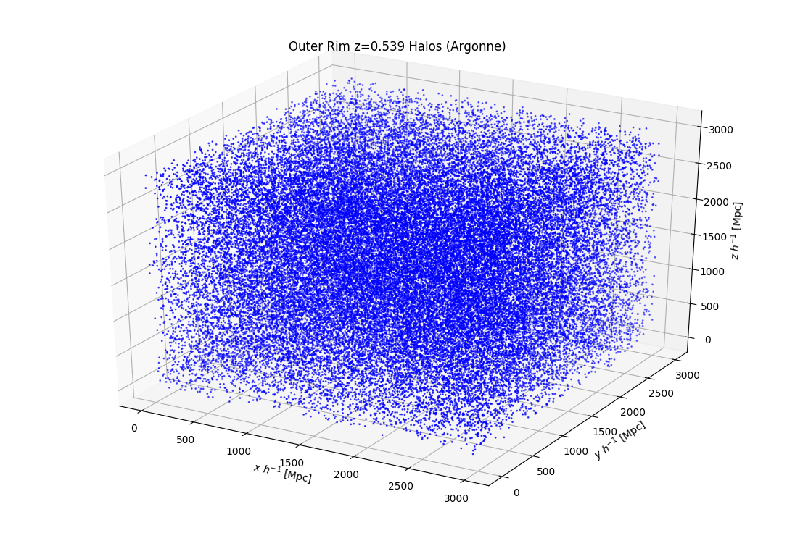
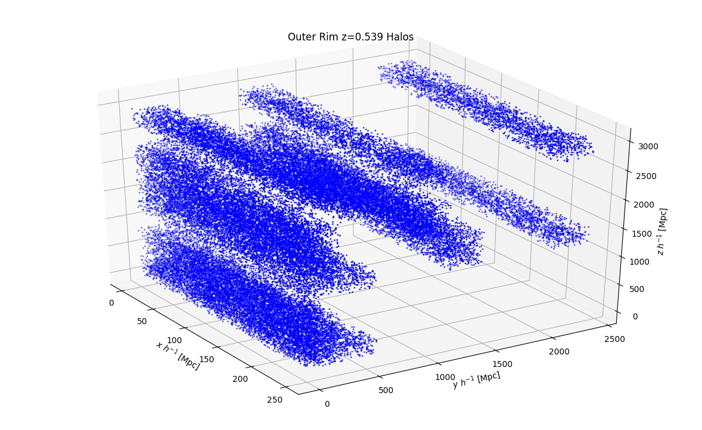
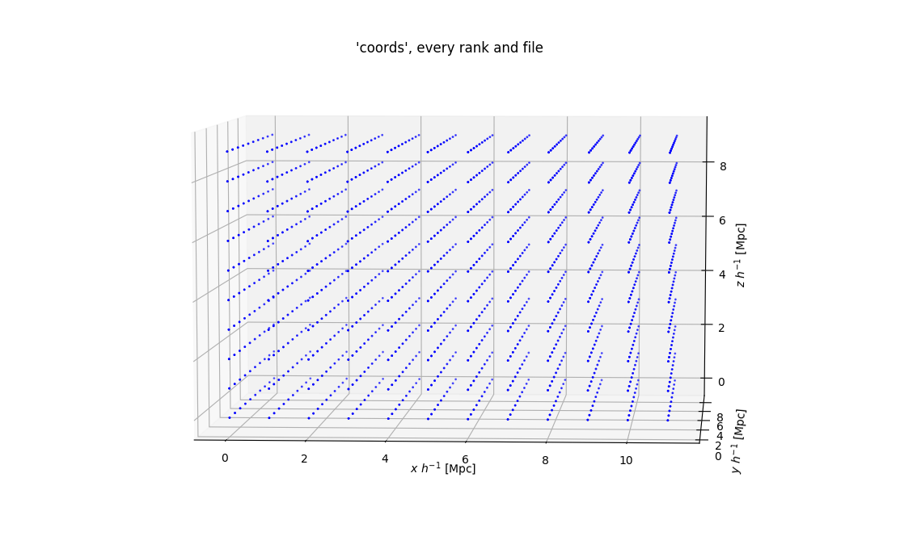

# plotting issues
```python
import pandas as pd
import numpy as np
cols = ['bin_1','bin_2','bin_3','stat_1','stat_2','stat_3','zbin']
dft = pd.DataFrame(np.random.rand(20,7),columns=cols)
dft['statname'] = 'wtheta'
dft.loc[3:5,'statname'] = 'xi'
zbin_cens = np.sort(dft.loc[dft['statname']=='wtheta','zbin'].unique())
zbin = 2
zzz = zbin_cens[zbin]
dft.drop(labels=dft.loc[((dft['statname']=='wtheta') & (dft['zbin']!=zzz))].index)
```

# Load Fake halo catalog
```python
from halotools.sim_manager import FakeSim
halocat = FakeSim()
htbl = halocat.halo_table # astropy table
htbl.info
```

# Concentration of Outer Rim halos
<!-- fs concentration -->
```python
from halotools.sim_manager import UserSuppliedHaloCatalog
import main as main
import get_sim as gs
import transform_sim as ts
import plots as plots
import genericio as gio
param_dict = {  'sim_name': 'outerrim',
                'stats': ['wtheta', 'xi', 'wp'],
                'galplots': False,
                'keep_halo_frac': 0.1}
p = main.load_param_dict(param_dict)
# halocat = gs.load_outerrim(p)
halo_metafile, read_cols, name_df_cols = gs.load_outerrim_data_setup(p)
# halo_metafile = halo_metafile+'#87' # load only 1 file
data = gio.read(halo_metafile, read_cols)
metadata, halodata = gs.load_outerrim_halotools_setup(p, data, name_df_cols)
halocat = UserSuppliedHaloCatalog(**metadata, **halodata)
gals_PS = gs.popHalos_usingHOD(halocat, p)
plots.plot_galaxies(gals_PS, title="Sim Galaxies")
gals_PS, gals_RDZ, p = ts.transform(p, gals_PS)
plots.plot_galaxies(gals_PS, title="Sim Galaxies Transformed")
plots.plot_galaxies(gals_PS, title="Sim Galaxies Transformed", coords='rz')
rands_PS, rands_RDZ = main.get_randoms(p)
boxes = { 'gals_PS':gals_PS, 'gals_RDZ':gals_RDZ,
          'rands_PS':rands_PS, 'rands_RDZ':rands_RDZ }
cs.calc_stats(p, boxes)
plots.plot_stats(str(p['statfout']), save=None, show=True)
```
<!-- fs plot concentration scaling of linking length (More+11 equ 13) -->
```python
import numpy as np
from matplotlib import pyplot as plt
def psi_More2011(c):
    # c = concentration
    cp1 = c+1
    mu = np.log(cp1) - c/cp1
    psi = c**2/mu/cp1**2
    return psi
carr = np.linspace(0.01,25)
plt.plot(carr, psi_More2011(carr))
c0, c2, c10, c25 = (0.1, 2, 10, 25)
slope_low = (psi_More2011(c2)-psi_More2011(c0))/(c2-c0) # = -0.447
slope_mid = (psi_More2011(c10)-psi_More2011(c2))/(c10-c2) # = -0.059
slope_hi = (psi_More2011(c25)-psi_More2011(c10))/(c25-c10) # = -0.010
# Zentner+2019: We set a maximum value of c = 25 to the NFW concentration, because
# haloes with very large values for the concentration tend to be poorly
# described by an NFW profile, for example due to a recent merger.
```
<!-- fe plot concentration scaling of linking length (More+11 equ 13) -->
<!-- fe concentration -->

# Load Outer Rim data and generate galaxy df on Korriban
<!-- fs Outer Rim Setup -->
<!-- fs using Argonne GenericIO -->
```python
import pandas as pd
import genericio as gio
from halotools.sim_manager import UserSuppliedHaloCatalog
import main as main
import plots
import get_sim as gs
halo_dir = "/home/tjr63/Osiris/BAO_simdata/OuterRim/M000/L4225/HACC000/analysis/" + \
            "Halos/b0168/FOFp/"
# redshift 0.502242
halo_files = ['STEP331/m000-331.fofproperties'] + \
             ['STEP331/m000-331.fofproperties#{}'.format(n) for n in range(87,105)]
# redshift 0.539051
halo_files = ['STEP323/m000-323.fofproperties'] + \
          ['STEP323/m000-323.fofproperties#{}'.format(n) for n in range(87,105)]

f = halo_dir+halo_files[0]
gio.inspect(f)

# Load all files and ranks to a DataFrame
read_cols = [ 'fof_halo_tag', 'fof_halo_mass', \
              'fof_halo_center_x', 'fof_halo_center_y', 'fof_halo_center_z' ]
data = gio.read(f, read_cols)
df_cols = [ 'halo_id', 'halo_mass', 'x','y','z' ]
df = pd.DataFrame(data.T, columns=df_cols)
# Plot coords of a random sample (see plot below)
plots.plot_galaxies(df, title="Outer Rim z=0.539 Halos (Argonne)")
# now have ALL data loaded

# Generate halocat and populate with HOD
selct = data.T[:,2] < 500 # get halos with x<500 Mpc/h
df_cols = [ 'halo_id', 'halo_mass', 'halo_x','halo_y','halo_z' ]
df = pd.DataFrame(data.T[selct,:], columns=df_cols)
df['halo_upid'] = -1
df.drop(columns='halo_count', inplace=True)
metadata, halodata = gs.load_outerrim_halotools_setup(p, df)
halocat = UserSuppliedHaloCatalog(**metadata, **halodata) # gives MemoryError

# Test HOD setup with a sample from a single file
param_dict = {  'sim_name': 'outerrim',
                'sim_redshift': 0.539051,
                'sim_Lbox': 3000.0,
                'sim_particle_mass': 1.85e9,
                'stats': ['wtheta', 'xi', 'wp'],
                'galplots': False,
                # 'HOD_model':
                }
p = main.load_param_dict(param_dict)
f = halo_dir+halo_files[1]
read_cols = [ 'fof_halo_tag', 'fof_halo_mass',
              'fof_halo_center_x', 'fof_halo_center_y', 'fof_halo_center_z',
              'fof_halo_mean_vx', 'fof_halo_mean_vy', 'fof_halo_mean_vz' ]
data = gio.read(f, read_cols)
df_cols = [ 'halo_id', 'halo_mvir', 'halo_x','halo_y','halo_z', 'halo_vx','halo_vy','halo_vz' ]
df = pd.DataFrame(data.T, columns=df_cols)
df['halo_upid'] = -1
df['halo_hostid'] = df['halo_id']
metadata, halodata = gs.load_outerrim_halotools_setup(p, df)
halocat = UserSuppliedHaloCatalog(**metadata, **halodata)
kwargs = {
        'conc_mass_model': 'dutton_maccio14',  # halotools.empirical_models.NFWProfile() and NFWPhaseSpace()
        # 'mdef': ,  # halotools.empirical_models.NFWProfile() and NFWPhaseSpace()
        }
HODmodel = PrebuiltHodModelFactory(p['HOD_model'], redshift=p['sim_redshift'], **kwargs)
for key, val in p['HOD_params'].items():
    HODmodel.param_dict[key] = val
HODmodel.populate_mock(halocat) #, halo_mass_column_key='halo_mass')
```

<!-- fe using Argonne GenericIO -->

<!-- Using the code below (with forked genericio) does NOT load all downloaded data. -->
<!-- fs using forked version of Generic_IO -->
```python
import sys
import os
# sys.path.insert(1, os.path.join(sys.path[0], '/home/tjr63/Documents/genericio/python/'))
# from mpi4py import MPI
import generic_io
import numpy as np
import pandas as pd
import plots # assumes in BAO dir

halo_dir = "/home/tjr63/Osiris/BAO_simdata/OuterRim/M000/L4225/HACC000/analysis/" + \
            "Halos/b0168/FOFp/"
# redshift 0.502242
halo_files = ['STEP331/m000-331.fofproperties'] + \
             ['STEP331/m000-331.fofproperties#{}'.format(n) for n in range(87,105)]
# redshift 0.539051
halo_files = ['STEP323/m000-323.fofproperties'] + \
          ['STEP323/m000-323.fofproperties#{}'.format(n) for n in range(87,105)]

# Load and look at the non-hashed file
f = os.path.join(halo_dir,halo_files[0])
gio = generic_io.Generic_IO(f, None)
metadata = gio.read_metadata(1)
colnames = gio.read_column_headers()

# Load all files
read_cols = [ 'fof_halo_count', 'fof_halo_tag', 'fof_halo_mass', \
              'fof_halo_center_x', 'fof_halo_center_y', 'fof_halo_center_z' ]
coldat = []
for hf in halo_files:
    gio = generic_io.Generic_IO(os.path.join(halo_dir,hf), None)
    coldat.append(gio.read_columns(read_cols))
df = pd.concat(coldat, axis=0)
df = df.rename(
            columns={'fof_halo_center_x':'x', 'fof_halo_center_y':'y', 'fof_halo_center_z':'z'})

# Plot coords of a random sample (see plot below)
plots.plot_galaxies(df, title="Outer Rim z=0.539 Halos")

# Inspect a random file... am I loading all the data? Seems like no.
## bash
## wc -l /home/tjr63/Osiris/BAO_simdata/OuterRim/M000/L4225/HACC000/analysis/Halos/b0168/FOFp/STEP323/m000-323.fofproperties#90
## 13404298
f = os.path.join(halo_dir,'STEP323/m000-323.fofproperties#90')
gio = generic_io.Generic_IO(f, None)
cdat = [gio.read_columns(colnames=read_cols)]
df1 = pd.concat(cdat, axis=0)
len(df1)
# 1534862
## OoM lower than number of lines in the file!
md, coords, dims = ([] for i in range(3))
for hf in halo_files:
    gio = generic_io.Generic_IO(os.path.join(halo_dir,hf), None)
    metadata = gio.read_metadata(0)
    numranks = metadata['num_ranks']
    for i in range(numranks):
        m = gio.read_metadata(i)
        coords.append(np.array(m['coords']))
        # dims.append(np.array(m['dims'])) # these are ALL [12,10,10]
        md.append(m)
cdf = pd.DataFrame(np.vstack(coords), columns=['x','y','z'])
# ddf = pd.DataFrame(np.vstack(dims), columns=['x','y','z'])
plots.plot_galaxies(cdf, title="'coords', every rank and file") # see plot below

coldat = []
for i in range(numranks):
    coldat.append(gio.read_columns(colnames=read_cols))
df = pd.concat(coldat, axis=0)
dup = df.duplicated()
sum(dup)
#######
```


<!-- fe using forked version of Generic_IO -->

### Load Particle and Lightcone data
<!-- fs Particle and Lightcone catalogs -->
```python
import pandas as pd
import genericio as gio
import main as main
import plots
import get_sim as gs
base_dir = "/home/tjr63/Osiris/BAO_simdata/OuterRim/M000/L4225/HACC000/analysis/"
halo_dir = base_dir + "Halos/b0168/FOFp/"
particle_dir = base_dir + "Particles/"
lightconeHalos_dir = base_dir + "Lightcones/Halos/"
# redshift 0.539051
halo_files = ['STEP323/m000-323.fofproperties'] + \
              ['STEP323/m000-323.fofproperties#{}'.format(n) for n in range(87,105)]
particle_files = ['STEP323/m000.mpicosmo.323#118']
lightconeHalos_files = ['lcHalos121/lc_intrp_halos_fof_matched.121#94']

# f = halo_dir + halo_files[0]
# f = particle_dir + particle_files[0]
f = lightconeHalos_dir + lightconeHalos_files[0]
gio.inspect(f)
```
<!-- fe Particle and Lightcone catalogs -->

<!-- fe Outer Rim Setup -->
