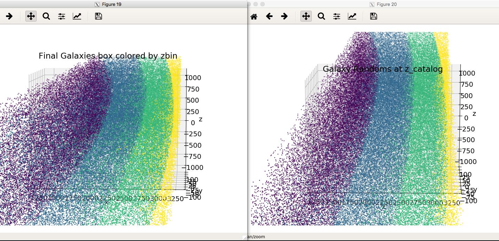
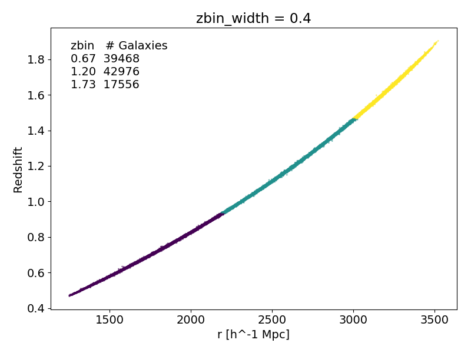

# Questions

- [ ] Does  look ok?
- [ ] Theta bins: range, number, lin or log space?
- [ ] Redshift bins: how wide?

# To Do

- [ ] Redshift calculation

# Archive
<!-- fs -->

# Questions

- [x]  why do peculiar velocities scatter redshift more towards observer than away
    * 
    * The do not! see zoom in of 

<!-- fe Archive -->
