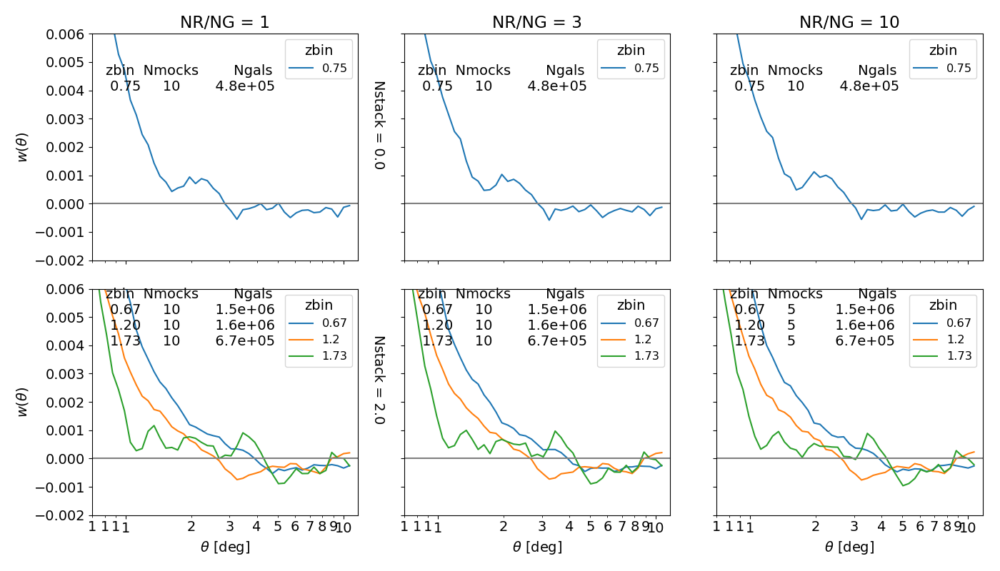
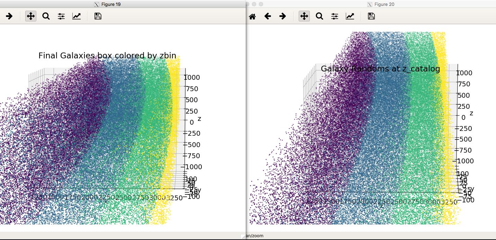
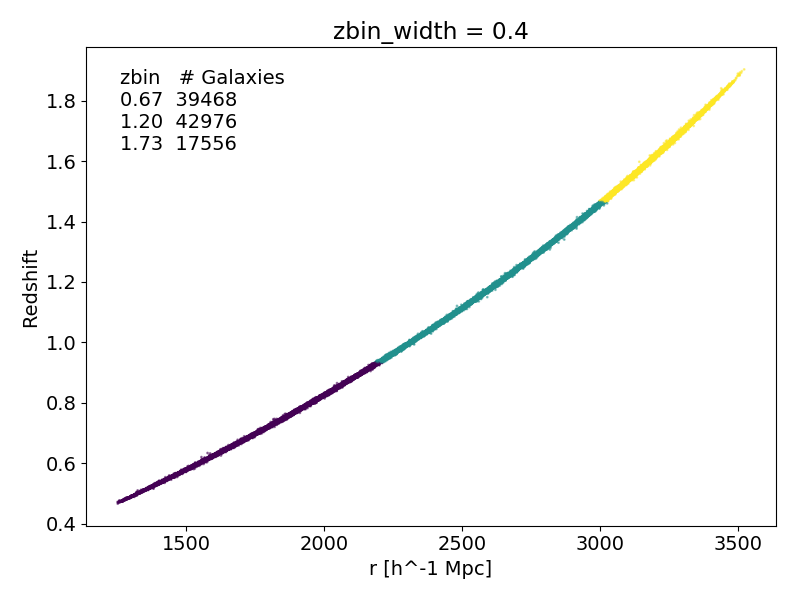

# Outer Rim Simulation Info
Downloading data with Globus Connect Personal
Korriban setup key c41f2d31-aab6-4e02-abfe-a075554cd226 # could not complete setup here
Roy setup key f6be8bf5-c3e7-47e4-85c8-5387b1980459

h = 0.71
Volume = (4.225 Gpc)^3 = (3000 h^-1 Mpc)^3
Num Particles = 10240^3
Mass resolution = 2.6e9 M_sun = 1.85e9 h^-1 M_sun
FoF linking length, b = 0.168

# Questions

- [ ]  what's wrong?
- [x] Theta bins: range, number, lin or log space?
        * ANS: go a few degrees past signal. try different spacings
- [ ] : d_BAO = 150Mpc so need r(z) in Mpc, not Mpc/h?
- [ ] Redshift bins: how wide?

# DOING

- [ ] try current main.py, z4push=0

# To Do

- [x] wtheta plot: subplots with rows Nstack, cols Nrands/Ngals

- [ ] Redshift calculation
- [ ] test integral constraint with Bolshoi
    * generally correlation fnc integrated over entire space must = 0
    * part of the integral constraint is real and part is an artifact
    * test integral constraint with Bolshoi
    * one thing correlation function tells you is fluctuation of number density on scale of box/theta (sample or cosmic variance)

# Archive
<!-- fs -->

# Questions

- [x]  why do peculiar velocities scatter redshift more towards observer than away
    * 
    * The do not! see zoom in of 

<!-- fe Archive -->
