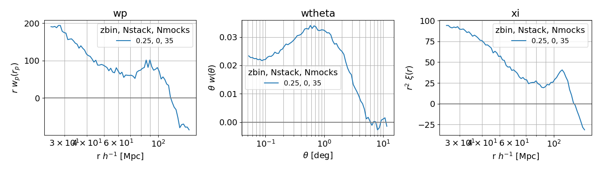
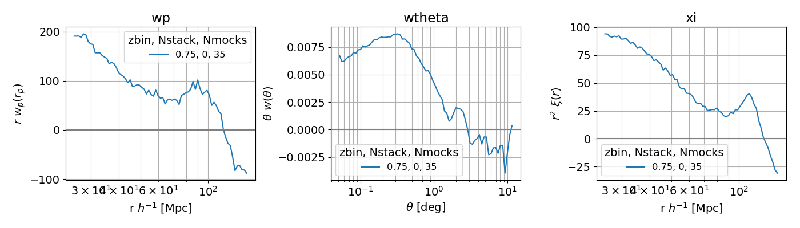
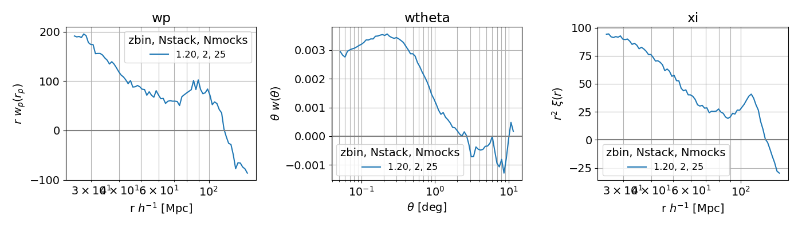

# Test Corrfunc.theory xi, wp
<!-- fs -->
<!-- fs Run main.py with:
python -c "import helper_fncs as hf; hf.file_ow('main.out')"
python -u main.py >> main.out # -u forces unbuffered stdout

# DEFAULTS:
statfout='data/stats.dat'
stats=['wtheta', 'xi', 'wp']
nbins = 51
tbin_edges = np.logspace(np.log10(0.1), np.log10(12.0), nbins+1)
rbin_edges = np.logspace(np.log10(75.0), np.log10(150.0), nbins+1)
pimax = 300
galplots=False
z4push = 'cat'
zw = 10.
cat_gals = 5e5 # approx num gals in cat mock
Nstack = 2 # number of mock boxes to stack, per dimension
nrfact = 1 # used in Nrands
Nrands = int(nrfact*cat_gals* max(Nstack,1)**3)
imax = 10 # number of times to run each param combo
-->
<!-- Run
import myplots as mp
statfout='data/stats_Nstack0_z4push0.dat'
mp.plot_stats(statfout, save='plots/stats_Nstack0_z4push0.png', show=True)
statfout='data/stats_Nstack0.dat'
mp.plot_stats(statfout, save='plots/stats_Nstack0.png', show=True)
statfout='data/stats_defaults.dat'
mp.plot_stats(statfout, save='plots/stats_defaults.png', show=True)
-->

<!-- fe Run main.py with: -->

- [x] Nstack=0, z4push=0
    - statfout='data/stats_Nstack0_z4push0.dat'
    - plot_stats(statfout, save='plots/stats_Nstack0_z4push0.png', show=True)
    

- [x] Nstack=0
    - statfout='data/stats_Nstack0.dat'
    - plot_stats(statfout, save='plots/stats_Nstack0.png', show=True)
    

- [x] Defaults
    - statfout='data/stats_defaults.dat'
    - plot_stats(statfout, save='plots/stats_defaults.png', show=True)
    

<!-- fe # Test Corrfunc.theory xi, wp -->
