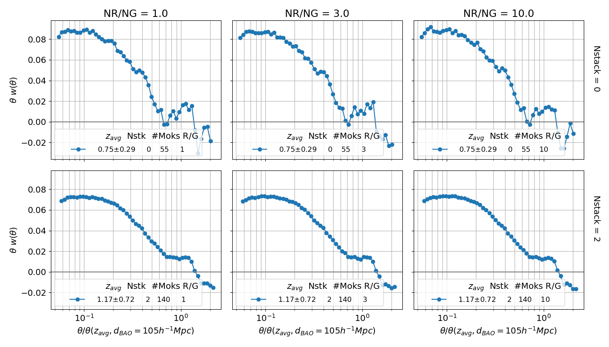
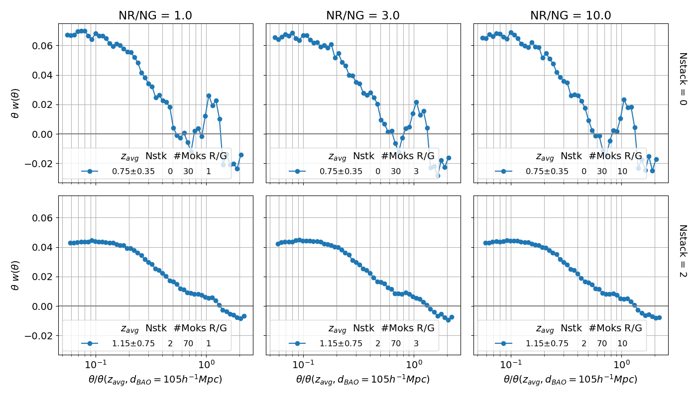

# Deal with NaNs in wtheta stats output
<!-- fs -->
```python
import numpy as np
import myplots as mp
import matplotlib as mpl
from matplotlib import pyplot as plt
fsog = mpl.rcParams['figure.figsize']
mpl.rcParams['figure.figsize'] = [14.0, 3.0]
# mpl.rcParams['figure.figsize'] = fsog

taglst = ['stats_tratiobins_zw0.05', 'stats_tratiobins_zw0.1', 'stats_tratiobins_zw0.15']
flist = ['data/'+tag+'.dat' for tag in taglst]
df = mp.load_statsdat(flist, stat='wtheta', clean=True)
df['RG'] = np.round(df['Nrands']/df['Ngals']) # NR/NG
# Plot total number of NaNs per column
nuls = df.isnull().sum(axis=0)
nuls[nuls>0].plot()
plt.ylabel('# NaN values');
plt.title('stats_tratiobins_zw[0.05, 0.1, 0.15]; {} total rows'.format(len(df)));
plt.savefig('plots/test/stat_Nans_per_thetabin.png'); plt.show(block=False)
# cleaup for groupbys
df['zwidth'] = 0.05*np.round(df.zwidth/0.05)
df.loc[df.zwidth>0.15,'zwidth'] = 0.15
df.loc[df.RG==4, 'RG'] = 3; df.loc[df.RG>10, 'RG'] = 10
# Plot total number of NaNs per {zwidth, Nstack, RG}
sz = df.groupby([df.Nstack, df.zwidth, df.RG]).size()
nas = df.isnull().sum(axis=1).groupby([df.Nstack, df.zwidth, df.RG]).sum()/sz
nas.plot(marker='o');
plt.xticks(np.arange(len(nas)), rotation=60); plt.gca().set_xticklabels(nas.index.values);
plt.ylabel('# NaN values per zbin'); plt.tight_layout(); plt.show(block=False)
# nacols = df.isnull().any(axis=0)
# narows = df.isnull().any(axis=1)
```
- [x] Drop rows of wdf where Nrands < 1000
    - check zbin of these rows. Done: they are all the last (max) zbin as expected
- [ ] Histograms:
    - \# NaN values per 'stat_#' (theta bin) column
        - these do not include any row (mock zbin slice) where `Nrands<1000`
        - there are 75 theta bins, all those not shown have 0 NaNs
        
    - Total \# NaNs in any 'stat_#' column
        - groupby NR/NG, Nstack, zwidth


<!-- fe # Deal with NaNs in wtheta stats output -->


# Test tratio_binedges
<!-- fs -->
`python -u main.py >> maintratiobins.out`
<!-- fs run main.py with:

# DEFAULTS:
stats=['wtheta', 'xi', 'wp']
nbins = 75
# tbin_edges = np.logspace(np.log10(0.05), np.log10(9.0), nbins+1)
tratio_binedges = np.logspace(np.log10(0.01), np.log10(2.), nbins+1)
rbin_edges = np.logspace(np.log10(25.0), np.log10(150.0), nbins+1)
pimax = 300
galplots = False
z4push = 'cat'
zw_list = [0.1, 0.05, 0.15]
cat_gals = 5e5 # approx num gals in cat mock
Nstack_list = [0, 2] # number of mock boxes to stack, per dimension
nrfact_list = [1, 3, 10] # used in Nrands
# Nrands = int(nrfact*cat_gals* max(Nstack,1)**3)
imax = 5 # number of times to run each param combo
 -->
<!-- Plots:
import myplots as mp
tags = ['stats_tratiobins_zw0.1', 'stats_tratiobins_zw0.05', 'stats_tratiobins_zw0.15']
for tag in tags:
    mp.plot_wtheta('data/'+tag+'.dat', avg_zbins=True, save='plots/'+tag+'.png')
 -->
<!-- fe run main.py with: -->
**Need to rerun these combining theta*wtheta before taking the average.**
Also should label x-axis as theta_avg or in units of theta_BAO.

- [x] zbin width = 0.05.
    - tag: stats_tratiobins_zw0.05
    

- [x] zbin width = 0.1.
    - tag: stats_tratiobins_zw0.1
    

- [x] zbin width = 0.15.
    - tag: stats_tratiobins_zw0.15
    


<!-- fe # Test tratio_binedges -->


# Test NR/NG = 0.1, 0.01
<!-- fs -->
`python -u main.py >> mainNRNGsmall.out`
<!-- fs run main.py with:

# DEFAULTS:
statfout='data/stats.dat'
stats=['wtheta', 'xi', 'wp']
nbins = 75
tbin_edges = np.logspace(np.log10(0.05), np.log10(9.0), nbins+1)
rbin_edges = np.logspace(np.log10(25.0), np.log10(150.0), nbins+1)
pimax = 300
galplots = False
z4push = 'cat'
zw_list = [10, 0.3]
cat_gals = 5e5 # approx num gals in cat mock
Nstack_list = [0, 2] # number of mock boxes to stack, per dimension
nrfact_list = [0.01, 0.1] # used in Nrands
# Nrands = int(nrfact*cat_gals* max(Nstack,1)**3)
imax = 20 # number of times to run each param combo
 -->
<!-- Plots:
import myplots as mp
statfout='data/stats_NRNGsmall_zw10.dat'
mp.plot_wtheta(statfout, save='plots/stats_NRNGsmall_zw10.png')
statfout='data/stats_NRNGsmall_zw0.3.dat'
mp.plot_wtheta(statfout, save='plots/stats_NRNGsmall_zw0.3.png')
 -->

<!-- fe fs python -u main.py >> mainNRNGsmall.out -->
- [x] Full box (no redshift binning). tag: stats_NRNGsmall_zw10
    

- [x] Redshift bin width = 0.3. tag: stats_NRNGsmall_zw0.3
    

<!-- fe # Test NR/NG = 0.1, 0.01 -->


# Test Corrfunc.theory xi, wp
<!-- fs -->
<!-- fs Run main.py with:
python -c "import helper_fncs as hf; hf.file_ow('main.out')"
python -u main.py >> main.out # -u forces unbuffered stdout

# DEFAULTS:
statfout='data/stats.dat'
stats=['wtheta', 'xi', 'wp']
nbins = 51
tbin_edges = np.logspace(np.log10(0.1), np.log10(12.0), nbins+1)
rbin_edges = np.logspace(np.log10(75.0), np.log10(150.0), nbins+1)
pimax = 300
galplots=False
z4push = 'cat'
zw = 10.
cat_gals = 5e5 # approx num gals in cat mock
Nstack = 2 # number of mock boxes to stack, per dimension
nrfact = 1 # used in Nrands
Nrands = int(nrfact*cat_gals* max(Nstack,1)**3)
imax = 10 # number of times to run each param combo
-->
<!-- Plots:
import myplots as mp
statfout='data/stats_Nstack0_z4push0.dat'
mp.plot_stats(statfout, save='plots/stats_Nstack0_z4push0.png', show=True)
statfout='data/stats_Nstack0.dat'
mp.plot_stats(statfout, save='plots/stats_Nstack0.png', show=True)
statfout='data/stats_defaults.dat'
mp.plot_stats(statfout, save='plots/stats_defaults.png', show=True)
-->

<!-- fe Run main.py with: -->

- [x] Nstack=0, z4push=0
    - statfout='data/stats_Nstack0_z4push0.dat'
    


- [x] Nstack=0
    - statfout='data/stats_Nstack0.dat'
    


- [x] Defaults
    - statfout='data/stats_defaults.dat'
    


<!-- fe # Test Corrfunc.theory xi, wp -->
